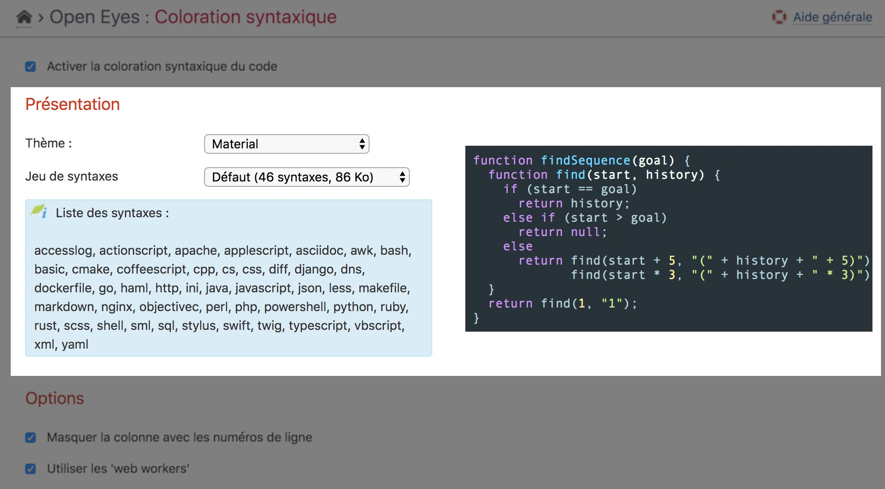
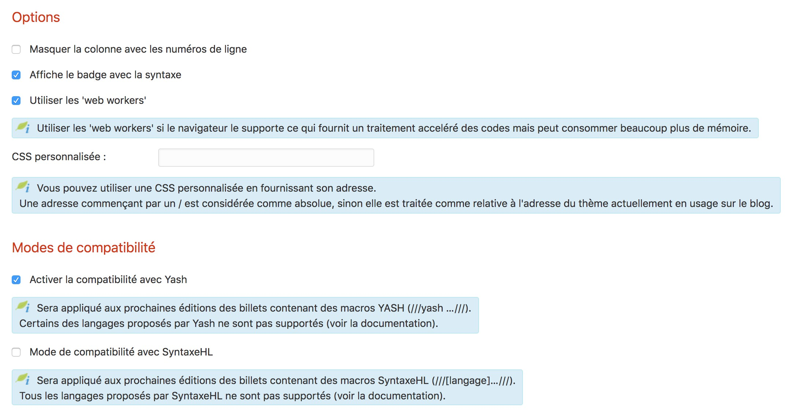

Settings
========

!!! note
    All settings done on the main page of the plugin is only related to the **current blog**


Activation
----------

The plugin **must** be activated before beeing used on **each** blog of the platform. This activation is done at the top of the setting page of the plugin (“Blog” menu → “Syntax highlighting”).


Presentation
------------

Different themes are provided with the plugin.



You may also provide a **user-defined CSS** URL to be used rather than the selected one. The URL beginning with a ```/``` is assumed to be **absolute** else it will be relative to the theme URL used for the blog.

You can also **hide the gutter** containing the line-numbers of the rendered code by the plugin.


Options
-------

The plugin is able to interpret the SyntaxeHL wiki macro form if activated here. See [according documentation](syntaxehl) for usage.



!!! warning
    You **should not** have the several syntax highlighter plugins (Yash, SyntaxeHL and HLJS) installed and activated on the same blog else you may encountered unpredictable results.
