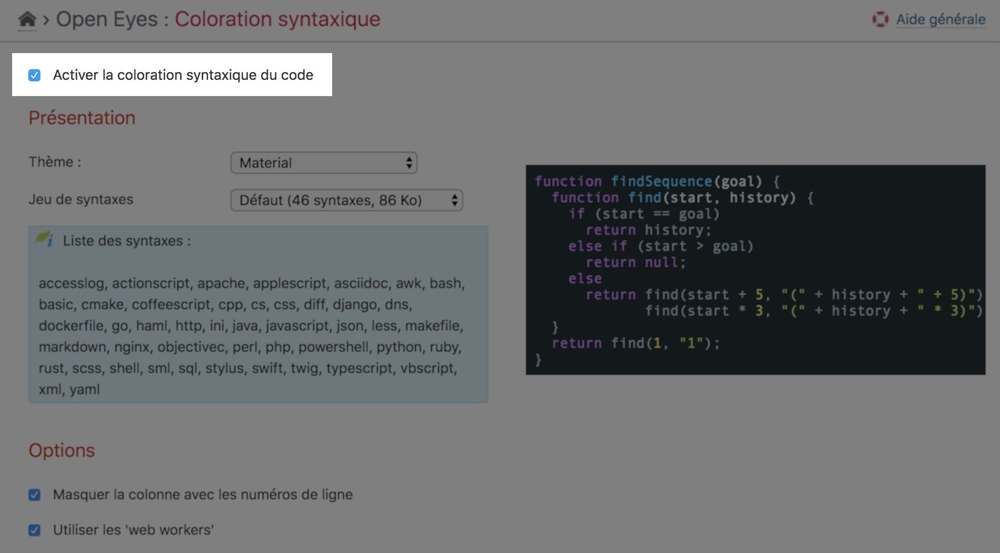

Settings
========

!!! note
    All settings done on the main page of the plugin is only related to the **current blog**


Activation
----------

The plugin **must** be activated before beeing used on **each** blog of the platform. This activation is done at the top of the setting page of the plugin (“Blog” menu → “Syntax highlighting”).




Presentation
------------

Different **Themes** are provided with the plugin.

You can select between 4 **Sets of syntaxes** (see [available syntaxes in each set](usage#available-syntaxes)).


Options
-------

You can **hide the gutter** containing the line-numbers of the rendered code by the plugin.

You may use **web workers** to provide parallel processing of your code samples (may be useful with big code samples on page). Enable this mode may consume a **lot more memory** in browser's client.

You may also provide a **user-defined CSS** URL to be used rather than the selected one. The URL beginning with a ```/``` is assumed to be **absolute** else it will be relative to the theme URL used for the blog.

The plugin is able to interpret the **YASH** wiki macro form if activated here. See [according documentation](yash) for usage.

The plugin is also able to interpret the **SyntaxeHL** wiki macro form if activated here. See [according documentation](syntaxehl) for usage.


!!! warning
    You **should not** have the several syntax highlighter plugins (Yash, SyntaxeHL and HLJS) installed and activated on the same blog else you may encountered unpredictable results.
