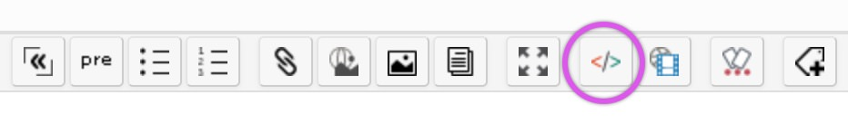

Usage
=====

The plugin should be activated for the blog (see main [setting page](/user-guide/settings) of this plugin) before using it.


Using HLJS in content
---------------------

In order to specify codes to be rendered by HLJS you have to use the following syntax:

In **Wiki** mode:

``` hl_lines="1"
///hljs [language_code]
...
///
```

In **HTML** (source) or **Markdown** modes:

``` html hl_lines="1"
<pre><code [class="language-{language_code}"]>
...
</code></pre>
```

Replacing ```language_code``` by one of the [following syntaxes](#available-syntaxes)

!!! tip
    Note that the plugin may **automatically** detect the language used in your code. In this case **do not specify** any language-code.

Exemple with this Javascript code:

``` js hl_lines="1"
///hljs js
function findSequence(goal) {
  function find(start, history) {
    if (start == goal)
      return history;
    else if (start > goal)
      return null;
    else
      return find(start + 5, "(" + history + " + 5)") ||
             find(start * 3, "(" + history + " * 3)");
  }
  return find(1, "1");
}
///
```

!!! tip
    A toolbar button is available for dcLegacyEditor (wiki/markown and wysiwyg in source mode) to select syntax:  

    


Available syntaxes
------------------

Min, Std and Com columns design respectively the Minimum, Standard and Commun Language Sets

| Min | Std | Com | Language code                                                | Syntaxe                              |
| --- | --- | --- | ------------------------------------------------------------ | ------------------------------------ |
| -   | -   | -   | plain                                                        | Plain text                           |
| -   | -   | -   | 1c                                                           | 1C:Enterprise (v7, v8)               |
| -   | -   | -   | abnf                                                         | Augmented Backus-Naur Form           |
| -   | x   | x   | accesslog                                                    | Apache/Nginx Access Logs             |
| -   | x   | x   | actionscript, as                                             | ActionScript                         |
| -   | -   | x   | ada                                                          | Ada                                  |
| x   | x   | x   | apache, apacheconf                                           | Apache configuration                 |
| -   | x   | x   | applescript, osascript                                       | AppleScript                          |
| -   | -   | -   | arduino                                                      | Arduino                              |
| -   | -   | x   | armasm, arm                                                  | ARM Assembler                        |
| -   | x   | x   | asciidoc, adoc                                               | AsciiDoc                             |
| -   | -   | -   | aspectj                                                      | AspectJ                              |
| -   | -   | -   | autohotkey, ahk                                              | AutoHotkey                           |
| -   | -   | x   | autoit                                                       | AutoIt                               |
| -   | -   | -   | avrasm                                                       | AVR Assembler                        |
| -   | x   | x   | awk                                                          | Awk                                  |
| -   | -   | -   | axapta                                                       | Axapta                               |
| x   | x   | x   | bash, sh, zsh                                                | Bash                                 |
| -   | x   | x   | basic                                                        | Basic                                |
| -   | -   | -   | bnf                                                          | Backus–Naur Form                     |
| -   | -   | -   | brainfuck, bf                                                | Brainfuck                            |
| -   | -   | -   | cal                                                          | C/AL                                 |
| -   | -   | -   | capnproto, capnp                                             | Cap’n Proto                          |
| x   | x   | x   | cbtpl, dctpl                                                 | Clearbricks/Dotclear template        |
| -   | -   | -   | ceylon                                                       | Ceylon                               |
| -   | -   | -   | clean, clean, icl, dcl                                       | Clean                                |
| -   | -   | x   | clojure, clj                                                 | Clojure                              |
| -   | -   | -   | clojure-repl                                                 | Clojure REPL                         |
| -   | x   | x   | cmake, cmake.in                                              | CMake                                |
| x   | x   | x   | coffeescript, coffee, cson, iced                             | CoffeeScript                         |
| -   | -   | -   | coq                                                          | Coq                                  |
| -   | -   | -   | cos, cos, cls                                                | Caché Object Script                  |
| x   | x   | x   | cpp, c, cc, h, c++, h++, hpp                                 | C++                                  |
| -   | -   | -   | crmsh, crm, pcmk                                             | crmsh DSL                            |
| -   | -   | -   | crystal, cr                                                  | Crystal                              |
| x   | x   | x   | cs, csharp                                                   | C#                                   |
| -   | -   | -   | csp                                                          | Content Security Policy              |
| x   | x   | x   | css                                                          | CSS                                  |
| -   | -   | x   | d                                                            | D                                    |
| -   | -   | x   | dart                                                         | Dart                                 |
| -   | -   | x   | delphi, dpr, dfm, pas, pascal, freepascal, lazarus, lpr, lfm | Delphi                               |
| x   | x   | x   | diff, patch                                                  | Diff                                 |
| -   | x   | x   | django, jinja                                                | Django                               |
| -   | x   | x   | dns, bind, zone                                              | DNS Zone file                        |
| -   | x   | x   | dockerfile, docker                                           | Dockerfile                           |
| -   | -   | x   | dos, bat, cmd                                                | DOS .bat                             |
| -   | -   | -   | dsconfig                                                     | LDAP dsconfig                        |
| -   | -   | -   | dts                                                          | Device Tree                          |
| -   | -   | x   | dust, dst                                                    | Dust                                 |
| -   | -   | -   | ebnf                                                         | Extended Backus-Naur Form            |
| -   | -   | x   | elixir                                                       | Elixir                               |
| -   | -   | x   | elm                                                          | Elm                                  |
| -   | -   | x   | erb                                                          | ERB (Embedded Ruby)                  |
| -   | -   | x   | erlang, erl                                                  | Erlang                               |
| -   | -   | x   | erlang-repl                                                  | Erlang REPL                          |
| -   | -   | x   | excel, xlsx, xls                                             | Excel formulae                       |
| -   | -   | -   | fix                                                          | FIX                                  |
| -   | -   | -   | flix                                                         | Flix                                 |
| -   | -   | x   | fortran, f90, f95                                            | Fortran                              |
| -   | -   | -   | fsharp, fs                                                   | F#                                   |
| -   | -   | -   | gams, gms                                                    | General Algebraic Modeling System    |
| -   | -   | -   | gauss, gss                                                   | GAUSS                                |
| -   | -   | -   | gcode, nc                                                    | G-code (ISO 6983)                    |
| -   | -   | -   | gherkin, feature                                             | Gherkin                              |
| -   | -   | -   | glsl                                                         | OpenGL Shading Language              |
| -   | x   | x   | go, golang                                                   | Go                                   |
| -   | -   | -   | golo                                                         | Golo                                 |
| -   | -   | -   | gradle                                                       | Gradle                               |
| -   | -   | -   | groovy                                                       | Groovy                               |
| -   | x   | x   | haml                                                         | Haml                                 |
| -   | -   | -   | handlebars, hbs, html.hbs, html.handlebars                   | Handlebars                           |
| -   | -   | x   | haskell, hs                                                  | Haskell                              |
| -   | -   | x   | haxe, hx                                                     | Haxe                                 |
| -   | -   | -   | hsp                                                          | HSP                                  |
| -   | -   | x   | htmlbars                                                     | HTMLBars                             |
| x   | x   | x   | http, https                                                  | HTTP request and response headers    |
| -   | -   | -   | hy, hylang                                                   | Hy                                   |
| -   | -   | -   | inform7, i7                                                  | Inform 7                             |
| -   | -   | -   | ini, toml                                                    | Ini                                  |
| -   | -   | -   | irpf90                                                       | IRPF90                               |
| x   | x   | x   | java, jsp                                                    | Java                                 |
| x   | x   | x   | javascript, js, jsx                                          | JavaScript                           |
| -   | -   | -   | jboss-cli, wildfly-cli                                       | jboss-cli                            |
| x   | x   | x   | json                                                         | JSON                                 |
| -   | -   | -   | julia                                                        | Julia                                |
| -   | -   | -   | julia-repl                                                   | Julia REPL                           |
| -   | -   | -   | kotlin                                                       | Kotlin                               |
| -   | -   | -   | lasso, ls, lassoscript                                       | Lasso                                |
| -   | -   | x   | ldif                                                         | LDIF                                 |
| -   | -   | -   | leaf                                                         | Leaf                                 |
| -   | x   | x   | less                                                         | Less                                 |
| -   | -   | x   | lisp                                                         | Lisp                                 |
| -   | -   | -   | livecodeserver                                               | LiveCode                             |
| -   | -   | x   | livescript, ls                                               | LiveScript                           |
| -   | -   | -   | llvm                                                         | LLVM IR                              |
| -   | -   | -   | lsl                                                          | Linden Scripting Language            |
| -   | -   | x   | lua                                                          | Lua                                  |
| x   | x   | x   | makefile, mk, mak                                            | Makefile                             |
| x   | x   | x   | markdown, md, mkdown, mkd                                    | Markdown                             |
| -   | -   | x   | mathematica, mma                                             | Mathematica                          |
| -   | -   | x   | matlab                                                       | Matlab                               |
| -   | -   | -   | maxima                                                       | Maxima                               |
| -   | -   | -   | mel                                                          | Maya Embedded Language               |
| -   | -   | -   | mercury, m, moo                                              | Mercury                              |
| -   | -   | x   | mipsasm, mips                                                | MIPS Assembly                        |
| -   | -   | -   | mizar                                                        | Mizar                                |
| -   | -   | -   | mojolicious                                                  | Mojolicious                          |
| -   | -   | -   | monkey                                                       | Monkey                               |
| -   | -   | -   | moonscript, moon                                             | MoonScript                           |
| -   | -   | -   | n1ql                                                         | N1QL                                 |
| x   | x   | x   | nginx, nginxconf                                             | Nginx                                |
| -   | -   | -   | nimrod, nim                                                  | Nimrod                               |
| -   | -   | -   | nix, nixos                                                   | Nix                                  |
| -   | -   | -   | nsis                                                         | Nullsoft Scriptable Install System   |
| x   | x   | x   | objectivec, mm, objc, obj-c                                  | Objective-C                          |
| -   | -   | x   | ocaml, ml                                                    | OCaml                                |
| -   | -   | -   | openscad, scad                                               | OpenSCAD                             |
| -   | -   | x   | oxygene                                                      | Oxygene                              |
| -   | -   | -   | parser3                                                      | Parser3                              |
| x   | x   | x   | perl, pl, pm                                                 | Perl                                 |
| -   | -   | -   | pf, pf.conf                                                  | pf                                   |
| x   | x   | x   | php, php3, php4, php5, php6                                  | PHP                                  |
| -   | -   | -   | pony                                                         | Pony                                 |
| -   | x   | x   | powershell, ps                                               | PowerShell                           |
| -   | -   | -   | processing                                                   | Processing                           |
| -   | -   | x   | profile                                                      | Python profile                       |
| -   | -   | x   | prolog                                                       | Prolog                               |
| -   | -   | -   | protobuf                                                     | Protocol Buffers                     |
| -   | -   | x   | puppet, pp                                                   | Puppet                               |
| -   | -   | x   | purebasic, pb, pbi                                           | PureBASIC                            |
| x   | x   | x   | python, py, gyp                                              | Python                               |
| -   | -   | x   | q, k, kdb                                                    | K/Q/Kdb+                             |
| -   | -   | -   | qml, qt                                                      | Qt Quick QML                         |
| -   | -   | x   | r                                                            | R                                    |
| -   | -   | -   | rib                                                          | RenderMan RIB                        |
| -   | -   | x   | roboconf, graph, instances                                   | Roboconf                             |
| -   | -   | -   | routeros, mikrotik                                           | Microtik RouterOS script             |
| -   | -   | -   | rsl                                                          | RenderMan RSL                        |
| x   | x   | x   | ruby, rb, gemspec, podspec, thor, irb                        | Ruby                                 |
| -   | -   | x   | ruleslanguage                                                | Oracle Rules Language                |
| -   | x   | x   | rust, rs                                                     | Rust                                 |
| -   | -   | x   | scala                                                        | Scala                                |
| -   | -   | x   | scheme                                                       | Scheme                               |
| -   | -   | -   | scilab, sci                                                  | Scilab                               |
| -   | x   | x   | scss                                                         | SCSS                                 |
| x   | x   | x   | shell, console                                               | Shell Session                        |
| -   | -   | -   | smali                                                        | Smali                                |
| -   | -   | x   | smalltalk, st                                                | Smalltalk                            |
| -   | x   | x   | sml, ml                                                      | SML                                  |
| -   | -   | -   | sqf, sqf                                                     | SQF                                  |
| x   | x   | x   | sql                                                          | SQL                                  |
| -   | -   | -   | stan                                                         | Stan                                 |
| -   | -   | -   | stata, do, ado                                               | Stata                                |
| -   | -   | -   | step21, p21, step, stp                                       | STEP Part 21                         |
| -   | x   | x   | stylus, styl                                                 | Stylus                               |
| -   | -   | -   | subunit                                                      | SubUnit                              |
| -   | x   | x   | swift                                                        | Swift                                |
| -   | -   | x   | taggerscript                                                 | Tagger Script                        |
| -   | -   | -   | tap                                                          | Test Anything Protocol               |
| -   | -   | x   | tcl, tk                                                      | Tcl                                  |
| -   | -   | x   | tex                                                          | TeX                                  |
| -   | -   | -   | thrift                                                       | Thrift                               |
| -   | -   | -   | tp                                                           | FANUC TP                             |
| -   | x   | x   | twig, craftcms                                               | Twig                                 |
| -   | x   | x   | typescript, ts                                               | TypeScript                           |
| -   | -   | -   | vala                                                         | Vala                                 |
| -   | -   | x   | vbnet, vb                                                    | VB.NET                               |
| -   | x   | x   | vbscript, vbs                                                | VBScript                             |
| -   | -   | x   | vbscript-html                                                | VBScript in HTML                     |
| -   | -   | -   | verilog, v, sv, svh                                          | Verilog                              |
| -   | -   | -   | vhdl                                                         | VHDL                                 |
| -   | -   | x   | vim                                                          | Vim Script                           |
| -   | -   | x   | x86asm                                                       | Intel x86 Assembly                   |
| -   | -   | -   | xl, tao                                                      | XL                                   |
| x   | x   | x   | xml, html, xhtml, rss, atom, xjb, xsd, xsl, plist            | HTML, XML                            |
| -   | -   | -   | xquery, xpath, xq                                            | XQuery                               |
| -   | x   | x   | yaml, yml, YAML, yaml                                        | YAML (Yet Another Markdown Language) |
| -   | -   | -   | zephir, zep                                                  | Zephir                               |

